# 🏥 MediCare Pharmacy Management System

A full‑stack enterprise web application designed to digitalise and automate pharmacy operations. The system supports multi‑branch management, role‑based access control, medication inventory with batch tracking, point of sale (POS), prescriptions, patient records, purchasing, alerts, reporting, and more.

## ✨ Features

- **🔐 Secure Authentication** – JWT‑based login with four roles: Admin, Manager, Pharmacist, Cashier
- **🏢 Multi‑Branch Management** – Each user is assigned to a branch; all data (inventory, sales, patients, prescriptions) is automatically scoped to that branch. Admins can switch between branches.
- **👥 User Management** – Full CRUD for users with role and branch assignment
- **📦 Inventory & Batch Tracking** – Medications with barcodes, batches with expiry, purchase/selling prices, and branch‑specific stock views
- **🛒 Point of Sale (POS)** – Branch‑aware medication list, camera barcode scanning (ZXing), FEFO batch selection, cart, patient & prescription linking, discount, payment methods
- **💊 Prescriptions & Patients** – Digital prescriptions with multiple medications, dosage, duration; patient records – all filtered by branch for non‑admin users
- **📊 Dashboard & Analytics** – Live stats cards, interactive sales trend (line) and top medications (bar) charts (ECharts), recent sales, active alerts
- **📄 Invoices & Reports** – PDF invoice generation, CSV export for medications / patients / sales
- **🔔 Alerts** – Automatic low‑stock and expiry alerts with email notifications to admins/managers
- **📝 Audit Logs** – Track every create / update / delete with user, timestamp, and details
- **🌙 Modern UI** – Responsive design, dark/light mode toggle, skeleton loaders, toast notifications, animated sidebar, modern action buttons
- **🐳 Dockerised** – One‑command startup with Docker Compose (backend + frontend + database)
- **🔍 Barcode Scanning** – Camera scanner (ZXing) and manual input for USB scanners
- **📧 Email Notifications** – Low‑stock / expiry alerts sent via Spring Boot Mail
- **🔄 Soft‑delete** – Batch removal via quantity set to zero (preserves data integrity)
- **🎨 Charts** – Dark‑mode‑aware ECharts integration

---

## 🛠️ Technology Stack

| Layer               | Technology |
|----------------------|------------|
| **Backend**          | Java 17, Spring Boot 3.2, Spring Security, Spring Data JPA (Hibernate) |
| **Frontend**         | Angular 19 (standalone components), TypeScript, Bootstrap 5, Font Awesome |
| **Database**         | PostgreSQL 16 |
| **Authentication**   | JWT (JSON Web Tokens), BCrypt |
| **PDF**               | iText 8 |
| **Charts**            | ECharts (via ngx-echarts) |
| **Barcode**           | ZXing (@zxing/ngx-scanner, @zxing/library) |
| **Email**             | Spring Boot Mail (JavaMailSender) |
| **Build**              | Maven (backend), Angular CLI (frontend) |
| **Containerisation**  | Docker, Docker Compose |
| **Testing**           | JUnit 5, Mockito (backend) |

---

## 📐 Architecture

**Layered architecture** with clear separation of concerns:

```
Angular Frontend ↔ REST API (JSON) ↔ Spring Boot Backend ↔ PostgreSQL
```

- **Frontend:** Standalone components → Services → HTTP Interceptor (JWT) → Backend
- **Backend:** Controllers → Services → Repositories → Entities
- **Security:** Stateless JWT filter chain with method‑level `@PreAuthorize`
- **Exception handling:** Global `@RestControllerAdvice` for clean JSON errors

---

## 🚀 Quick Start

### Prerequisites
- Java 17+
- Node.js 18+ & npm
- Docker Desktop
- Angular CLI (`npm install -g @angular/cli`)

### 1. Start the full stack with Docker (recommended)

```bash
docker compose up -d --build
```

Access the application at http://localhost

Login: `admin@pharmacy.com` / `admin123`

### 2. Development mode (run services separately)

```bash
# Start only the database
docker compose up -d postgres

# Backend
cd backend
./mvnw spring-boot:run

# Frontend
cd frontend
npm install
ng serve
```

Frontend: http://localhost:4200

---

## 📖 User Roles

| Role | Access |
|------|--------|
| **Admin** | Full system access – all branches, users, suppliers, medications, inventory, POS, prescriptions, patients, reports, alerts, audit logs |
| **Manager** | Own branch: inventory, purchases, suppliers, medications, POS, patients, reports, alerts |
| **Pharmacist** | Own branch: POS, prescriptions, patients, medications, alerts |
| **Cashier** | Own branch: Dashboard, POS |

**Branch‑scoping:** Non‑admin users automatically see only data belonging to their own branch. Admins can switch branches via the selector in the inventory and POS pages.

---

## 📸 Screenshots

| | |
|---|---|
| **Login** 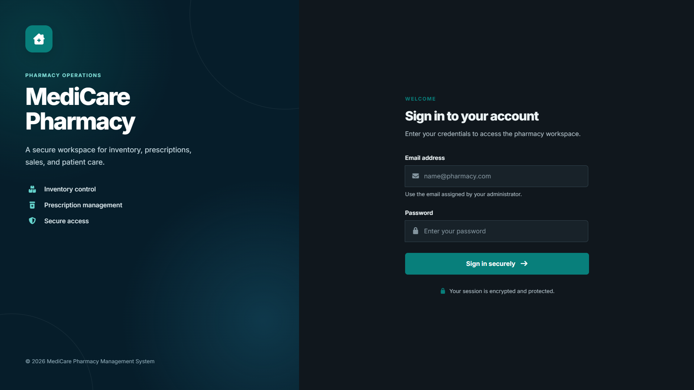 | **Dashboard** 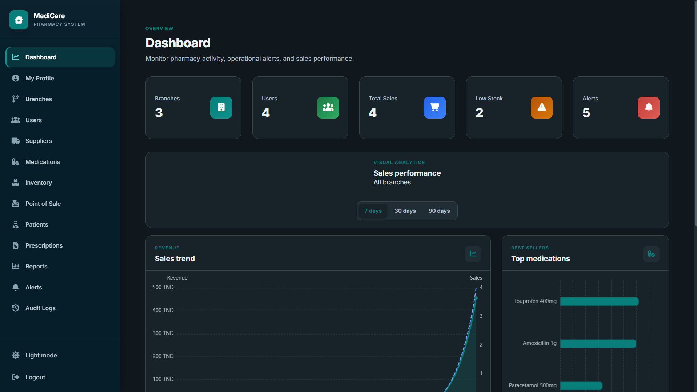 |
| **User Management** 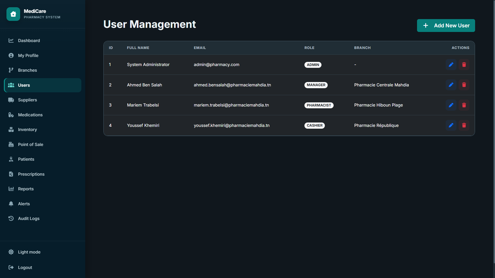 | **Point of Sale** 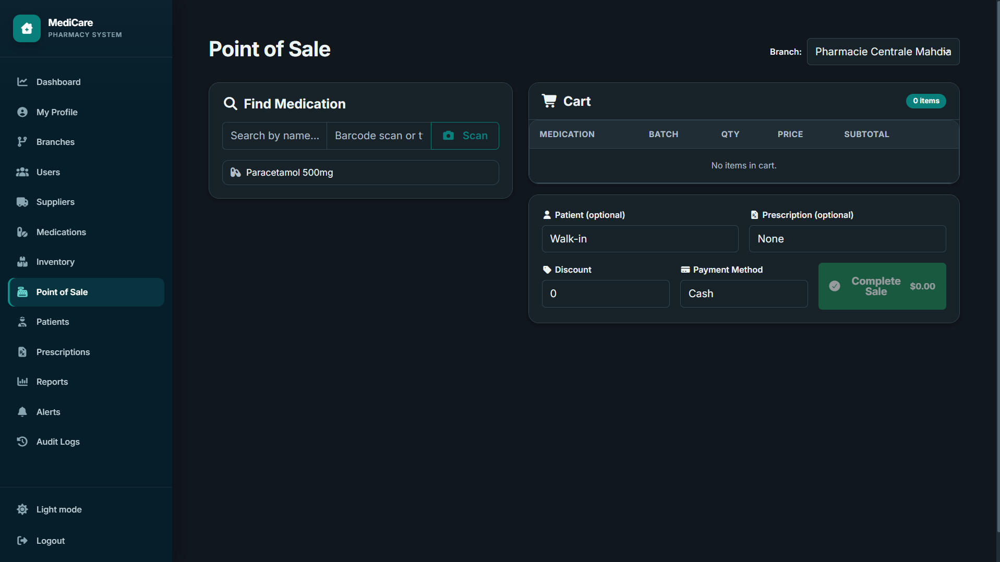 |
| **Reports**  | **Alerts**  |
| **Stock** 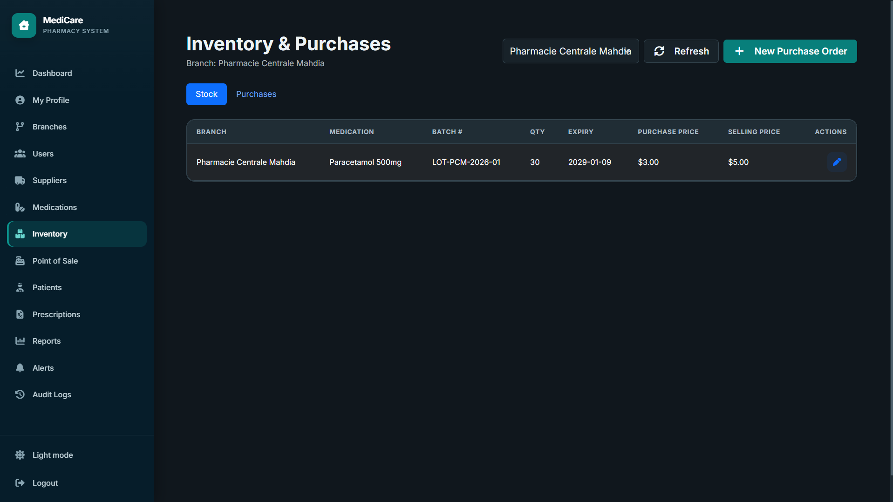 | **Purchases** 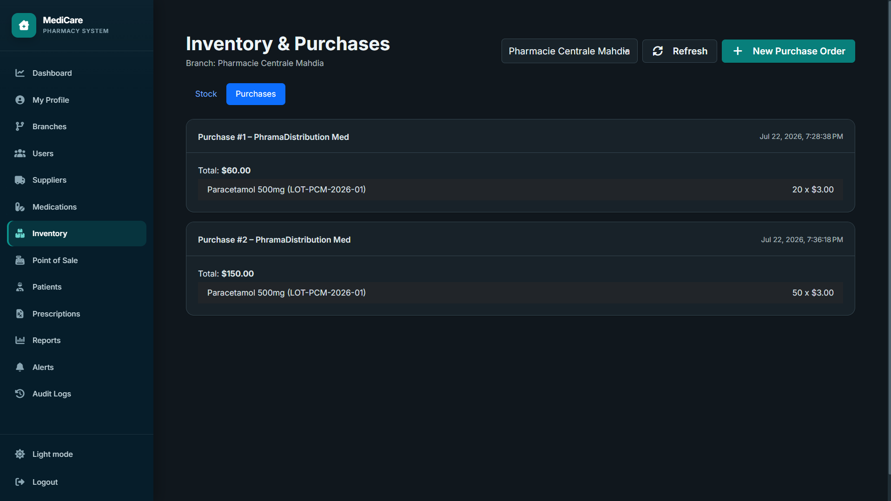 |
| **Prescriptions**  | **Medications**  |
| **Audit Logs**  | **Profile** 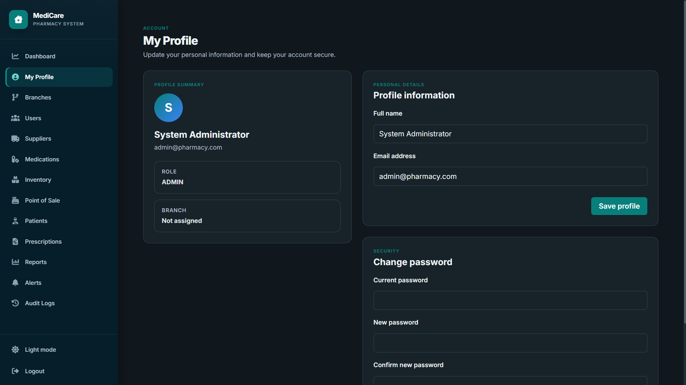 |
| **Branches** 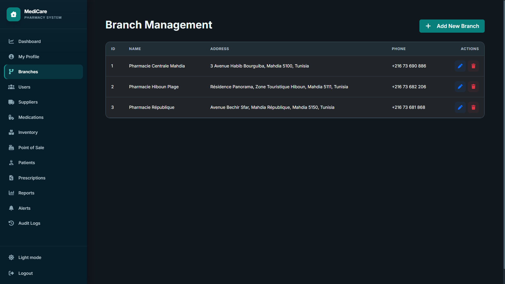 | **Patients** 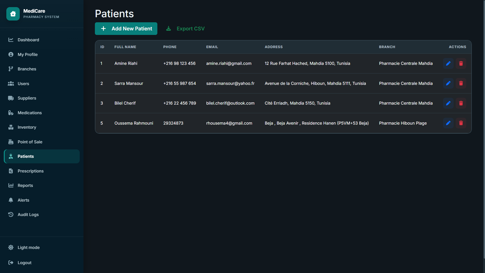 |
| **Suppliers** 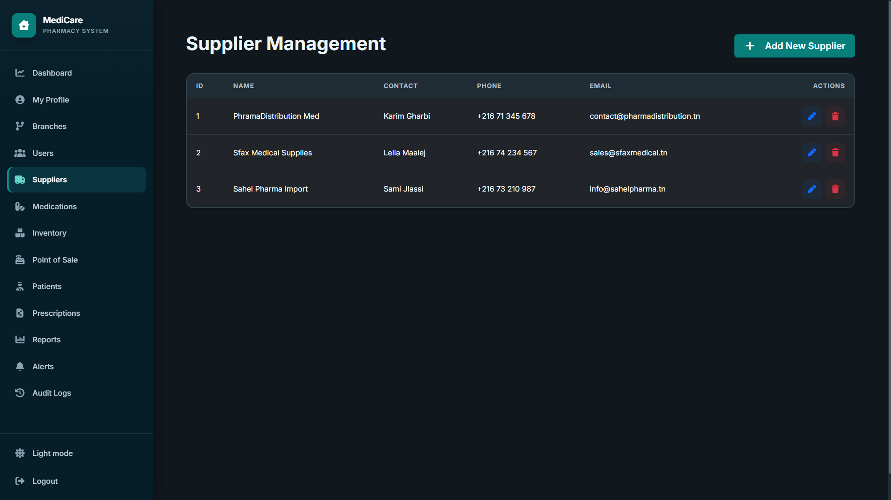 | **Light Mode** 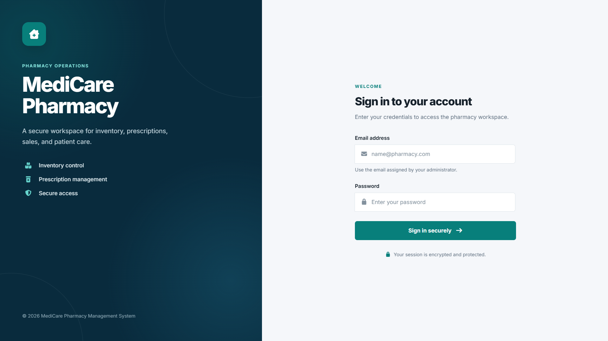 |

---

## 🎥 Demo Video

▶ [Watch the full demo video (Google Drive)](https://drive.google.com/file/d/1QTxo3JQe3fA4yXSt4fWaREEztzduRnnc/view?usp=sharing)

---

## 📖 Documentation

- **Swagger UI:** http://localhost:8080/swagger-ui/index.html (after backend starts)
- **UML Diagrams & ERD:** located in `docs/diagrams.md`
- **Presentation outline:** `docs/presentation.md`

---

## 📦 Deployment

The system is fully containerised. For production:

1. Set environment variables for database credentials and JWT secret.
2. Use a reverse proxy (Nginx / Traefik) with HTTPS.
3. Optionally deploy to cloud platforms (AWS ECS, Azure, etc.).

Contact the developer for a detailed deployment guide.

---

## 🧪 Running Tests

```bash
cd backend
./mvnw test
```

---

## 📝 License

This project is proprietary software. All rights reserved. Contact the developer for licensing options.

---

## 👨‍💻 Developer

**Rahmouni Oussema**
[GitHub](#)

---

## 📂 Project Structure

```
pharmacy-management-system/
├── backend/                          (Spring Boot)
│   ├── src/main/java/com/pharmacy/
│   │   ├── config/                   (DataInitializer)
│   │   ├── model/                    (Entities: User, Branch, Medication, Batch, …)
│   │   ├── repository/               (Spring Data JPA interfaces)
│   │   ├── dto/                      (Data Transfer Objects)
│   │   ├── service/                  (Business logic)
│   │   ├── controller/               (REST endpoints)
│   │   ├── security/                 (JWT filter, config)
│   │   ├── scheduler/                (AlertScheduler)
│   │   └── exception/                (GlobalExceptionHandler)
│   └── pom.xml
├── frontend/                         (Angular)
│   ├── src/app/
│   │   ├── core/                     (auth, models, services, interceptors)
│   │   ├── login/                    (login page)
│   │   ├── dashboard/                (dashboard with charts)
│   │   ├── layout/                   (sidebar, main layout)
│   │   ├── branches/                 (branch CRUD)
│   │   ├── users/                    (user CRUD)
│   │   ├── suppliers/                (supplier CRUD)
│   │   ├── medications/              (medication CRUD)
│   │   ├── inventory/                (stock & purchases)
│   │   ├── pos/                      (point of sale)
│   │   ├── patients/                 (patient CRUD)
│   │   ├── prescriptions/            (prescription CRUD)
│   │   ├── reports/                  (sales reports & CSV export)
│   │   ├── alerts/                   (low‑stock / expiry alerts)
│   │   ├── audit-logs/               (audit trail)
│   │   ├── profile/                  (user profile)
│   │   └── shared/                   (toast container)
│   ├── angular.json
│   ├── Dockerfile
│   └── nginx.conf
├── docker-compose.yml
├── README.md
└── docs/                             (UML diagrams, presentation)
```
